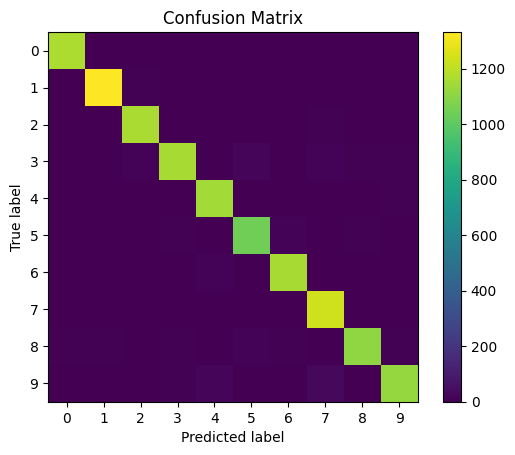
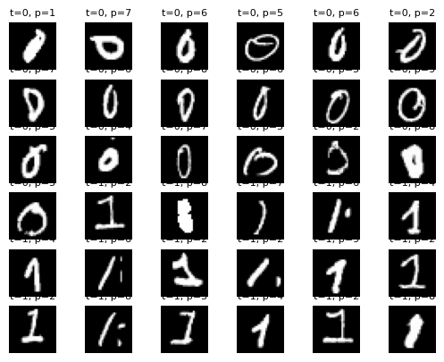

#  AI Individual Project : MNIST Image Classification  
**Pattern Recognition (CSC 4444) – Fall 2025**  
*Author: Carter Mauer | Louisiana State University*

---

##  Overview

This project implements multiple **machine learning and deep learning classifiers** to recognize handwritten digits from the **MNIST** dataset (0–9).  

It covers both **classical approaches** (KNN, Naïve Bayes, Linear Classifier using NumPy) and **modern neural network models** (Linear, MLP, and CNN using PyTorch).  
Each model is trained and evaluated on a custom training/validation split, and results are visualized with confusion matrices and model-specific weight maps.

---

##  Project Structure

```
AI-Project1-MAIN/
│
├── data/
│   └── MNIST/               # Raw MNIST images organized by digit (0–9)
│
├── partitions/              # Auto-generated JSONs for train/val splits
│   ├── train.json
│   └── val.json
│
├── experiments/             # Saved model weights and predictions (.npy / .pt)
│
├── src/
│   ├── numpy_impl/          # Classical ML models (NumPy)
│   │   ├── knn_numpy.py
│   │   ├── linear_numpy.py
│   │   └── naive_bayes_numpy.py
│   │
│   ├── torch_impl/          # Deep learning models (PyTorch)
│   │   ├── linear_torch.py
│   │   ├── mlp_torch.py
│   │   └── cnn_torch.py
│   │
│   └── utils/               # Utility modules
│       ├── data_utils.py
│       ├── make_partitions.py
│       ├── eval_and_viz.py
│       └── visualize.py
│
├── requirements.txt
└── README.md
```

---

##  Setup Instructions

### 1️⃣ Create a virtual environment and install dependencies

**Windows PowerShell**
```powershell
python -m venv .venv
.\.venv\Scripts\Activate.ps1
pip install --upgrade pip
pip install -r requirements.txt
```

**macOS / Linux**
```bash
python3 -m venv .venv
source .venv/bin/activate
pip install --upgrade pip
pip install -r requirements.txt
```

---

### 2️⃣ Organize your data

Your MNIST images must be structured like this:

```
data/MNIST/
  0/
  1/
  2/
  ...
  9/
```

Each folder should contain grayscale `.png` (or `.jpg`) images of digits.

---

### 3️⃣ Generate training and validation partitions
```bash
python -m utils.make_partitions --data_root "data/MNIST" --out_dir "partitions" --train_frac 0.8 --seed 1337
```
 This creates:
- `partitions/train.json`
- `partitions/val.json`

---

### 4️⃣ Train and test models

#### 🟦 NumPy Implementations (Classical ML)
```bash
# K-Nearest Neighbors
python -m numpy_impl.knn_numpy --data_root "data/MNIST" --partitions "partitions" --k 3

# Naïve Bayes
python -m numpy_impl.naive_bayes_numpy --data_root "data/MNIST" --partitions "partitions"

# Linear Classifier (NumPy)
python -m numpy_impl.linear_numpy --data_root "data/MNIST" --partitions "partitions" --lr 0.1 --epochs 10
```

####  PyTorch Implementations (Deep Learning)
```bash
# Linear Classifier (PyTorch)
python -m torch_impl.linear_torch --partitions "partitions" --lr 0.1 --epochs 10

# Multilayer Perceptron (MLP)
python -m torch_impl.mlp_torch --partitions "partitions" --lr 0.1 --epochs 10

# Convolutional Neural Network (CNN)
python -m torch_impl.cnn_torch --partitions "partitions" --lr 0.01 --epochs 10 --normalize_to_neg1
```

 Outputs saved to `/experiments`:
- Model weights (`.pt` or `.npy`)
- Validation predictions

---

### 5️⃣ Evaluate and visualize results
```bash
python -m utils.eval_and_viz --data_root "data/MNIST" --partitions "partitions" --preds "experiments/mlp_torch_val_preds.npy" --confusion --show_examples --save_dir "figures"
```
This will:
- Print validation accuracy
- Generate:
  - `figures/confusion.png` (confusion matrix)
  - `figures/misclassified.png` (sample mistakes)

Optional visualization:
```python
from utils.visualize import visualize_linear_weights, visualize_nb_theta
visualize_linear_weights("experiments/linear_numpy_W.npy", out_dir="figures")
visualize_nb_theta("experiments/nb_theta.npy", out_dir="figures")
```

---

##  Expected Performance (approx.)

| Model | Framework | Accuracy | Runtime |
|--------|------------|-----------|----------|
| KNN (k=3) | NumPy | ~95% |  30s |
| Naïve Bayes | NumPy | ~83% |  1–2 min |
| Linear Classifier | NumPy | ~88% |  30s |
| Linear Classifier | PyTorch | ~90% |  15s |
| MLP (784→256→128→10) | PyTorch | ~97% |  1–2 min |
| CNN (2 conv layers) | PyTorch | ~98–99% |  2–3 min |

---

##  Output Locations

| Folder | Description |
|---------|-------------|
| `experiments/` | Saved model weights and predictions |
| `figures/` | Confusion matrices and visualizations |
| `partitions/` | Train/validation JSON splits |

---

##  Notes

- All of the scripts work independently so you can train or test specific models without re-running others.  
- If you encounter `Train=0, Val=0`, check your `--data_root` path (should point directly to `data/MNIST`).  
- You can resize non-28×28 images by editing `read_grayscale()` in `data_utils.py`.

---

##  Key AI Concepts Used

- **KNN (Euclidean Distance)** for similarity-based classification  
- **Naïve Bayes (Bernoulli likelihood)** for probabilistic pixel modeling  
- **Linear Classifier** trained via gradient descent  
- **Multilayer Perceptron (MLP)** with ReLU activations  
- **Convolutional Neural Network (CNN)** with feature maps and pooling layers  
- **Cross-Entropy and MSE Loss Functions**  
- **Model evaluation via confusion matrix and accuracy metrics**

---

##  Tools & Libraries
- [Python 3.10+](https://www.python.org/)
- [NumPy](https://numpy.org/)
- [Pillow](https://python-pillow.org/)
- [Matplotlib](https://matplotlib.org/)
- [PyTorch](https://pytorch.org/)
- [TorchVision](https://pytorch.org/vision/stable/index.html)
- [Scikit-Learn](https://scikit-learn.org/stable/)

---

## 🧩 Example Visualizations

| Confusion Matrix | Misclassified Digits |
|------------------|----------------------|
|  |  |
